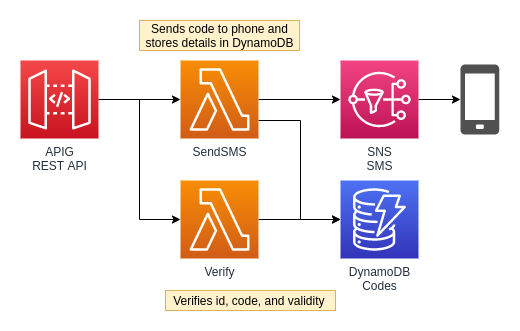

## TwoFac

SMS 2FA Verification Microservice using AWS API Gateway, AWS Lambda with Golang, and Dynamodb.


1. Initiate 2FA SMS code. SMS message with verification code is sent to phone number.

```
https://endpoint/+18005551234
```
2. Backend system receives a verification ID to use to confirm with backend that code from user matches.
```json
{
    "id": "1sobJsuqv0eRoM5deMbb6beF2Bc"
}
```

3. Backend receives 2FA code from frontend and calls Microservice with ID and code to confirm verification.
```
https://endpoint/{id}/{code}
```

4. 2FA code is invalidated after 5 minutes or if it is successfully validated.

